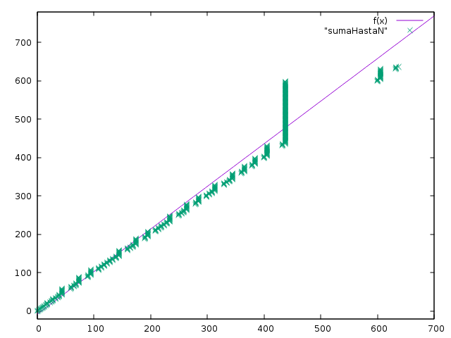
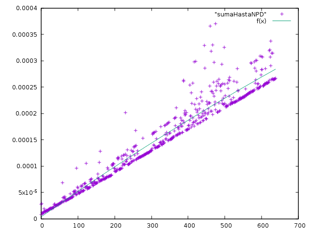
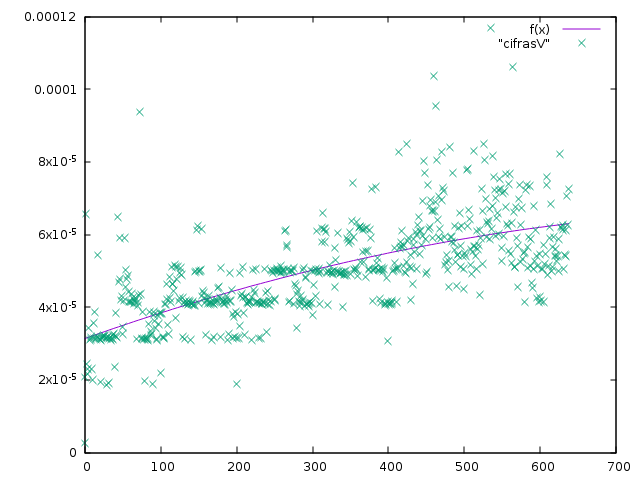
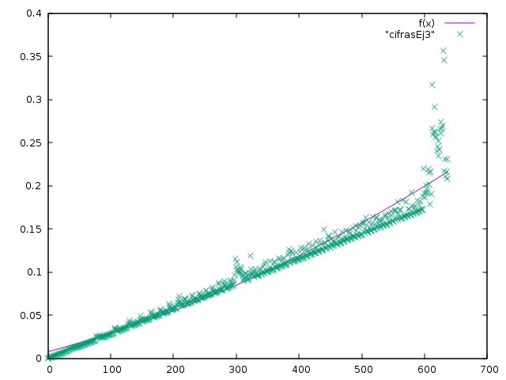

# **DOCUMENTACIÓN PRÁCTICA 3**
## ***ALGORÍTMICA - VORAZ Y PROGRAMACIÓN DINÁMICA***


<br><br>
### **Ejecución:** <br>
```language-shell
      ./script.sh <nombre-programa> <fichero-datos>
```
#### Donde: <br>
```language-shell
     <nombre-programa> puede ser:
                 sumaHastaN
                 sumaHastaNPD
                 cifrasV
                 cifrasEj3

     <fichero-datos> puede ser:
                 conjunto.txt
                 numeros1.txt
                 ...

```                 
 El script añade el directorio, solo hay que escribir el nombre, también genera los N.


### **Ejercicio 1**
---
##### *_______Ejercicio 1.1_______*
###### Subconjunto S de números que sume menor o igual que N - ***Voraz***
---
  1. ***Candidatos a seleccionar:*** <br>
  > &nbsp;&nbsp;&nbsp;&nbsp;&nbsp;&nbsp;Conjunto de números <br>
  2. ***Candidatos seleccionados:*** <br>
  > &nbsp;&nbsp;&nbsp;&nbsp;&nbsp;&nbsp;Subconjunto de números<br>
  3. ***Función solución:*** <br>
  > &nbsp;&nbsp;&nbsp;&nbsp;&nbsp;&nbsp;Suma <= N<br>
  4. ***Función factible:*** <br>
  > &nbsp;&nbsp;&nbsp;&nbsp;&nbsp;&nbsp;El valor no se pasa de N<br>
  5. ***Función selección:*** <br>
  > &nbsp;&nbsp;&nbsp;&nbsp;&nbsp;&nbsp;Siguiente número<br>
  6. ***Función objetivo:*** <br>
  > &nbsp;&nbsp;&nbsp;&nbsp;&nbsp;&nbsp;Tener un subconjunto cuya suma sea <= N<br>
---
**Observaciones:** <br>
El criterio de selección no encuentra la solución óptima siempre. Esto ocurre pues según el conjunto de datos,
el algoritmo de Voraz va recorriendo el vector comprobando cada valor y si es solución.
Puede dar lugar a que en el conjunto haya una solución (finaliza el algoritmo), pero posteriormente hubiese una mejor
que Voraz no tiene en cuenta. <br>
Por ejemplo: <br>
> S = {2, 5, 4, 4, 6} y M = 8 <br>
> Voraz: 2 + 5  <br>
> Solución óptima: 4 + 4 <br>

---
**Eficiencia:** <br>
 La eficiencia del algoritmo es O(n), ya que recorres el vector para ir comprobando los valores y hacer la suma. <br>
 El algoritmo que se sigue es el siguiente: <br>
  ```c  
  vector<int> sumaHastaN(const vector<int> & uno, int M){
    vector<int> res;
    int suma = 0;
    unsigned int pos = 0;

    while(pos < uno.size() && suma <= M){
        int elem = uno[pos];
        pos++;

        if((suma + elem) <= M){
            suma += elem;
            res.push_back(elem);
        }
    }
    return res;
  }
 ```

Según los estudios de eficiencia realizados, tras varias ejecuciones y con los datos guardados en:
> doc/sumaHastaN/sumaHastaN.txt




---
**Dificultad:** <br>
    &nbsp;&nbsp;&nbsp;&nbsp;&nbsp;&nbsp;6 sobre 10

---
##### *_______Ejercicio 1.2_______*
###### Subconjunto S de números que sume menor o igual que N - ***Programación Dinámica***

Suma(N, M) donde: <br>
N = Números a seleccionar <br>
M = Valor a llegar <br>


Suma(N, M) es:
* 0 si M = 0 
* M si N = 0 
* +∞ si M < 0 
* Min(Suma(N - 1, M), Suma(N - 1, M - N))  en otro caso 

Incluimos el número: <br>
   * Suma(N, M) = Suma(N - 1, M - N) <br>

No incluimos el número: <br>
   * Suma(N, M) = Suma(N - 1, M) <br>

**Tabla:** <br>
En la tabla representamos en las filas los distintos valores que hay hasta llegar a M, en las columnas representamos
los números posibles para incluir en la suma.
En cada celda estará la suma correspondiente a cada valor, hasta llegar a la celda de M, que será la solución. <br>

**Observaciones:** <br>
El algoritmo de Programación Dinámica encuentra la solución óptima del problema, pues comprueba todas las soluciones posibles y sus consecuencias, en cada número, decidiendo si incluimos el valor o no lo incluimos.
Dando, en ocasiones, situaciones a lo largo de la tabla en las que ambos caminos son posibles y generando así varias soluciones. <br>
Por ejemplo: <br>
>S = {4, 3, 2, 1, 5, 2, 10} y M = 10 <br>
>Puede generar tanto: 4 + 1 + 5 como 10

**Eficiencia:** <br>
La eficiencia del algoritmo es de O(n²), ya que recorres la matriz para ir rellenandola con los distintos valores en cada celda y probando todas las posibles soluciones según la decision tomada <br>
 El algoritmo que se sigue es el siguiente: <br>
```c
    vector<int> sumaHastaNPD(const vector<int> & uno, int M){
        vector< vector <int> > tabla(uno.size() + 1, vector<int>(M + 1, 0));
        vector<int> res;


        for( int i = 0; i <= M; i++)
              tabla[0][i] = i;

        for( int i = 0; i <= uno.size(); i++)
            tabla[i][0] = 0;

        for(int i = 1; i <= uno.size(); i++){
            for( int j = 1; j <= M; j++){
                int elem = uno[i - 1];
                if(j - elem < 0){
                    tabla[i][j] = tabla[i - 1][j];
                }else{
                    tabla[i][j] = Min( tabla[i - 1][j - elem], // Incluye el valor
                                       tabla[i - 1][j]        // No lo incluye
                                     );
                }
            }
        }

```
>Para recorrer la matriz al revés en busca de la solución:
```c
        int m = M;
        for(int i = uno.size(); i > 0; i--){
            if(tabla[i][m] != tabla[i-1][m]){
                res.push_back(i - 1);
                m -= uno[i - 1];
            }
        }
        return res;
    }
```


Según los estudios de eficiencia realizados, tras varias ejecuciones y con los datos guardados en:
> doc/sumaHastaNPD/sumaHastaNPD.txt




**Dificultad:** <br>
&nbsp;&nbsp;&nbsp;&nbsp;&nbsp;&nbsp;8.5 sobre 10


<br><br>
### **Ejercicio 2**
---
##### *_______Ejercicio 2.1_______*
###### Subconjunto de números (S) y de operaciones que, combinados, de lugar a N - ***Voraz***

---
  1. ***Candidatos a seleccionar:*** <br>
  > &nbsp;&nbsp;&nbsp;&nbsp;&nbsp;&nbsp;Conjunto de números y operaciones <br>
  2. ***Candidatos seleccionados:*** <br>
  > &nbsp;&nbsp;&nbsp;&nbsp;&nbsp;&nbsp;Subconjunto de números y operaciones<br>
  3. ***Función solución:*** <br>
  > &nbsp;&nbsp;&nbsp;&nbsp;&nbsp;&nbsp;El subconjunto seleccionado en combinacion con las operaciones da N <br>
  4. ***Función factible:*** <br>
  > &nbsp;&nbsp;&nbsp;&nbsp;&nbsp;&nbsp;La división no es entre 0 y no da distinto de 0, tampoco se multiplica por 0 <br>
  5. ***Función selección:*** <br>
  > &nbsp;&nbsp;&nbsp;&nbsp;&nbsp;&nbsp;Siguiente número y operación<br>
  6. ***Función objetivo:*** <br>
  > &nbsp;&nbsp;&nbsp;&nbsp;&nbsp;&nbsp;Tener un subconjunto de números y operaciones que sea igual a N<br>
---

**Observaciones:** <br>
El algoritmo Voraz no da la solución óptima, sin embargo en este caso si lo hace porque hacemos todas las operaciones posibles y buscamos aquella que nos dé el resultado más cercano. Además comprobamos si el resultado de la operación realizada es mejor o peor que el que tenemos para quedarnos con el mejor.
```c
 if(Factible(res_previo, M, res_operacion)){
                res.push_back(make_pair(*it, x.second));
            }else{
                res_operacion = res_previo;
            }
```
**Eficiencia:** <br>
La eficiencia de este algoritmo es O(n²), la función *Seleccionar* tiene dos bucles anidados, pero uno de ellos recorre las posibles operaciones, que sabemos que siempre son 4, por lo tanto tiene orden n.

```c
   for(unsigned int i = 0; i < op.size(); i++){
        for(unsigned int j = 0; j < uno.size(); j++){
            int res = Operacion(res_operacion, uno[j], op[i]);
            operaciones.push_back(make_pair(make_pair(uno[j], res), op[i]));
        }
    }
```
En *operaciones* guardamos todas las soluciones posibles, para luego comprobar cuál es la más cercana a N.
Esto tiene eficiencia de O(n).
```c
 for(unsigned int i = 1; i < operaciones.size(); i++){
        if(Factible( mas_cercano,  M , operaciones[i].first.second)){    
             mas_cercano = operaciones[i].first.second;
             operacion = operaciones[i].second;
             elem = operaciones[i].first.first;
        }
    }
```

En el algoritmo Voraz, lo primero que hacemos es ordenar el vector de mayor a menor con un QuickSort, que tiene eficiencia de n*log(n). 
Posteriormente recorremos el vector *uno* con los distintos valores para crear el subconjunto, por lo tanto esto nos da una eficiencia de O(n²).
```c
  while(uno.size() && res_operacion != M){
         pair<vector<int>::iterator, char> x = Seleccionar(res_operacion, uno, operaciones, M);
         
         vector<int>::iterator it = x.first;
         res_previo = res_operacion;
         if(it != uno.end() && HacerOperacion(res_operacion, *it, x.second)){
            if(Factible(res_previo, M, res_operacion)){
                res.push_back(make_pair(*it, x.second));
            }else{
                res_operacion = res_previo;
            }
         }
         it = uno.erase(it);
         
     }
```
Que es la eficiencia completa del algoritmo. <br>
Según los estudios de eficiencia realizados, tras varias ejecuciones y con los datos guardados en:
> doc/cifrasV/cifrasV.txt




---
**Dificultad:** <br>
&nbsp;&nbsp;&nbsp;&nbsp;&nbsp;&nbsp;9.5 sobre 10


<br><br>

##### *_______Ejercicio 2.2_______*
###### Subconjunto de números (S) y de operaciones que, combinados, de lugar a N - ***Programación Dinámica***

Busca_Conjunto(N, S) donde: <br>
N = Valor a llegar <br>
S = Números a seleccionar <br>


Busca_Conjunto(N, S) es:
* 0 si S = 0 
* S si N = 0 
* +∞ si S < 0 
* Min(  Busca_Conjunto(N - 1, S), <br>
&nbsp;&nbsp;&nbsp;&nbsp;&nbsp;&nbsp;&nbsp;        Busca_Conjunto(N - 1, N + S), <br>
&nbsp;&nbsp;&nbsp;&nbsp;&nbsp;&nbsp;&nbsp;        Busca_Conjunto(N - 1, N - S),           &nbsp;&nbsp;&nbsp;&nbsp;&nbsp;&nbsp;&nbsp;&nbsp;&nbsp;&nbsp;&nbsp;&nbsp;en otro caso  <br>
&nbsp;&nbsp;&nbsp;&nbsp;&nbsp;&nbsp;&nbsp;        Busca_Conjunto(N - 1, N * S), <br>
&nbsp;&nbsp;&nbsp;&nbsp;&nbsp;&nbsp;&nbsp;        Busca_Conjunto(N - 1, N / S) <br>
    )  <br>

No incluimos el número: <br>
   * Busca_Conjunto(N, S) = Busca_Conjunto(N - 1, S) <br>

Incluimos el número sumando: <br>
   * Busca_Conjunto(N, S) = Busca_Conjunto(N - 1, N + S) <br>


Incluimos el número restando: <br>
   * Busca_Conjunto(N, S) = Busca_Conjunto(N - 1, N - S) <br>


Incluimos el número multiplicando <br>
   * Busca_Conjunto(N, S) = Busca_Conjunto(N - 1, N * S) <br>


Incluimos el número dividiendo: <br>
   * Busca_Conjunto(N, S) = Busca_Conjunto(N - 1, N / S) <br>

**Tabla:** <br>
En la tabla, rellenamos las columnas con los distintos valores hasta M y las filas con los números del conjunto S.
En cada celda de la tabla tendremos el subconjunto de operaciones y números necesarios para llegar hasta cada valor.
Siendo la última celda las necesarias para llegar hasta M y la solución al problema.


**Observaciones:** <br>
El algoritmo de Programación Dinámica no encuentra la solución óptima para este problema, sin embargo, si hay una solución para dicho problema la va a encontrar puesto que hace las comprobaciones necesarias para que combinando los números con las operaciones se llegue hasta N. Esto es comprobando en cada caso si realizando la operación se está más cerca de N o no.
```c
      tabla[i][j].first=tabla[i-1][j].first;//no echarlo
      tabla[i][j].second = '?' ; 
     
      if (j-S[i-1]>=0)//sumando
        if (tabla[i][j].first > tabla[i-1][j-S[i-1]].first){
          tabla[i][j].first = tabla[i-1][j-S[i-1]].first;
		  tabla[i][j].second = '+';
	    }
       if (j+S[i-1]<=ncol)//restando
        if (tabla[i][j].first > tabla[i-1][j+S[i-1]].first){
          tabla[i][j].first = tabla[i-1][j+S[i-1]].first;
		  tabla[i][j].second = '-';	
	    } 
       if (j%S[i-1] == 0)//multiplicando
	    if (tabla[i][j].first > tabla[i-1][j/S[i-1]].first){
		 tabla[i][j].first = tabla[i-1][j/S[i-1]].first;
		 tabla[i][j].second = '*';
	    }
      if (j*S[i-1] <= ncol)//dividiendo
	   if (tabla[i][j].first > tabla[i-1][j*S[i-1]].first){
		tabla[i][j].first = tabla[i-1][j*S[i-1]].first;
		tabla[i][j].second = '/';		
	   }
```


**Eficiencia:** <br>
La eficiencia de este algoritmo es O(n²), ya que rellenas la tabla con todos los posibles resultados. <br>
Al principio se hace un QuickSort para ordenar los valores del conjunto de mayor a menor, esto sería O(nlog(n)).
Dentro de la función *Busca_Conjunto* tenemos dos bucles que rellenan las soluciones para 0 números en el subconjunto y para N = 0. <br>Posteriormente tenemos dos bucles anidados que rellenan la tabla con las distintas comprobaciones en las casillas, para ver la mejor solución posible en cada caso, esto tiene eficiencia O(n²) que es la eficiencia del algoritmo.

```c
for (i = 1; i <= nfil; i++){
  for(j = 1; j <= ncol; j++){
      tabla[i][j].first=tabla[i-1][j].first;//no echarlo
      tabla[i][j].second = '?' ; 
     
      if (j-S[i-1]>=0)//sumando
        if (tabla[i][j].first > tabla[i-1][j-S[i-1]].first){
          tabla[i][j].first = tabla[i-1][j-S[i-1]].first;
		  tabla[i][j].second = '+';
	    }
       if (j+S[i-1]<=ncol)//restando
        if (tabla[i][j].first > tabla[i-1][j+S[i-1]].first){
          tabla[i][j].first = tabla[i-1][j+S[i-1]].first;
		  tabla[i][j].second = '-';	
	    } 
       if (j%S[i-1] == 0)//multiplicando
	    if (tabla[i][j].first > tabla[i-1][j/S[i-1]].first){
		 tabla[i][j].first = tabla[i-1][j/S[i-1]].first;
		 tabla[i][j].second = '*';
	    }
      if (j*S[i-1] <= ncol)//dividiendo
	   if (tabla[i][j].first > tabla[i-1][j*S[i-1]].first){
		tabla[i][j].first = tabla[i-1][j*S[i-1]].first;
		tabla[i][j].second = '/';		
	   }
	}//endFOR
}//endFOR
```

Y finalmente un bucle for que recorre la tabla de forma inversa para quedarnos con la solución tomada.
```c
	j = M;

for(i = S.size(); i > 0; i--){
  if (tabla[i][j].first != tabla[i - 1][j].first){
	solution.push_back(make_pair(S[i-1], tabla[i][j].second));
	if(tabla[i][j].second == '-')
		j = j + S[i-1];
	if(tabla[i][j].second == '+')
		j = j - S[i-1];
	if(tabla[i][j].second == '/')
		j = j *S[i-1];
	if(tabla[i][j].second == '*')
		j = j /S[i-1];
  }

	}
```


Según los estudios de eficiencia realizados, tras varias ejecuciones y con los datos guardados en:
> doc/cifrasEj3/cifrasEj3.txt



---
**Dificultad:** <br>
&nbsp;&nbsp;&nbsp;&nbsp;&nbsp;&nbsp;10.5 sobre 10


<br><br>