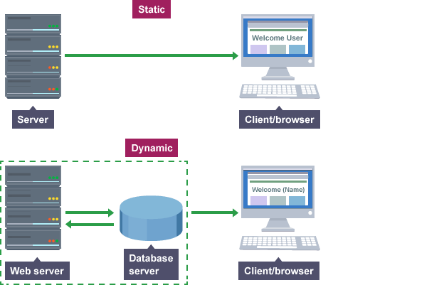
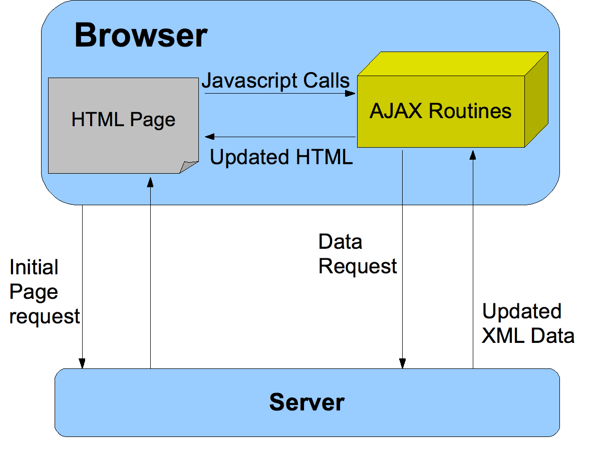
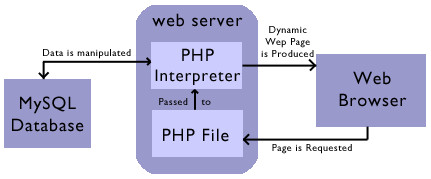

# HTTP


Http es un protocolo de comunicación basado en TCP/IP que se usa para intercambiar datos (Puerto TCP 80).

#### Caracteristicas
**No requiere conexion:**<br>
El cliente (ej. navegador) hace una petición, se desconecta del servidor, el servidor la procesa y al responder reestablece la conexion.
<br>**Puede enviarse ualquier contenido**<br>
Siempre que tanto el cliente como el servidor sepan como gestionarlo (MIME)
<br>**Independiencia cliente-servidor**<br>
Cliente y servidor solo se conocen a la hora de procesar peticiones, no almacenan informacion

#### Estructura
Se compone de una linea inicial, cero o mas campos cabecera, una linea en blanco indicando el final de la cabecera y un cuerpo opcional de mensaje

* Linea inicial: <br>
La linea inicial varia según si es una peticion del cliente o una respuesta del servidor <br>

Si es peticion del cliente, teniendo GET o otro metodo como DELETE y la versión http <br>
> GET /hello.htm HTTP/1.1 

Si es respuesta del servidor, version http, status y codigo del estado: <br>
> HTTP/1.1 200 OK 

* Campos de cabecera <br>
Varios campos con formato clave ":" valor <br>
Por ejemplo la fecha, el servidor, el idioma, tamaño del contenido, directorio del servidor, conexion...<br>
Pueden trabajar como modificadores de la peticion

Date: Sun, 18 Oct 2012 10:36:20 GMT <br>
Server: Apache/2.2.14 (Win32)<br>
Content-Length: 230<br>
Content-Type: text/html; charset=iso-8859-1<br>
Connection: Closed<br>

* Cuerpo del mensaje: <br>
Puede ser texto en html

GET /index.html HTTP/1.1

This requests ask for the file index.html. A request like this does not specify any host header. So if the webserver is configured so that a host header is required, the webserver does not know what to do with this request. The server should in this case (says the RFC) reply with a "400 Bad Request". A valid request looks like:

GET /index.html HTTP/1.1
Host: www.ilopia.com

# DOM

El DOM es la estructura de los documentos HTML XML y la forma en la que son accedidos.
Con el DOM, se puede navegar por la estructura de los documentos para añadir, modificar o eliminar elementos y contenido del propio documento.
Generalmente tiene estructura de arbol en la que las etiquetas mas externas son los nodos superiores.
Para acceder al DOM se hace con el nombre del elemento, con lenguajes como javascript.
Si hay varios objetos con el mismo nombre tendriamos un array.
Un ejemplo de uso:

```html
<section id="comentarios"> ... </section>
```
con javascript:
```javascript   
    document.getElementById("comentarios");
```

# PAGINA ESTATICA - DINAMICA DIAGRAMA COMUNICACION




# CLOUD COMPUTING 


**Interacción entre las plataformas de cloud computing y las tecnologías web**

Las plataformas de cloud computing disponen de las siguientes formas de ofrecer servicio, y de por tanto, interaccionar con las tecnologias web:
* **Infrastructure as a Service:** proporciona almacenamiento, capacidad de proceso y hardware a medida
* **Platform as a Service:** proporciona recursos para desarrollar una aplicacion web en cloud
* **Software as a Service:** proporciona aplicaciones de uso final que se están ejecutando en el cloud

Para desarrollar una aplicacion web en el cloud, se solicita hardware a medida (pay as you go) que se va modificando segun los requerimientos de la aplicacion web, de forma que es un tercero el que se encarga de la infraestructura y se da una imagen de recursos ilimitados


Es mas relevante el papel de las tecnologias web en las dos ultimas, PaaS y SaaS, ya que la primera se encarga de el back-end de la aplicacion y la primera de todo el front-end, por lo tanto en estas dos capas las tecnologias web cobran mas relevancia

# AJAX - CARACTERISTICAS Y DIFERENCIAS SIN/CON

Es una tecnica de desarrollo web que permite crear aplicaciones web interactivas. Se ejecutan en el cliente (navegador) y mantienen la comunicacion asincrona con el servidor en segundo plano, de forma que se pueden realizar cambios sobre las paginas sin necesidad de recargarlas.
Mejora la interactividad y velocidad de las paginas.
Si no se tuviese AJAX habria que recargar la pagina para actualizar de nuevo los contenidos.
Como inconveniente, AJAX no deja rastro en el historial del navegador asi que no se puede volver a un estado anterior de la pagina, tambien se puede sobrecargar el servidor de peticiones si no se programa bien AJAX.



# SERVICIO Y APLICACIONES WEB - HERRAMIENTAS,  DESARROLLO EN CLIENTE/SERVIDOR

**Servicio web:** conjunto de protocolos y tecnologias que se usan para intercambiar datos entre varias aplicaciones web (que pueden ser ejecutadas en plataformas diferentes). Se adoptan estandares abiertos para la compatibilidad entre plataformas.
Un servicio web podria ser una agencia de viajes por ejemplo.
Para su desarrollo es necesario el navegador por el lado del cliente y la infraestructura web por el lado del desarrollador (por ejemplo LAMP: Linux, Apache, MySQL, PHP)


**Aspectos importantes en el desarrollo de aplicaciones web:**
Deben integrar aspectos de seguridad, buena experiencia de usuario en el diseño, adaptable/responsive, javascript, arquitectura de la aplicacion (ej servidor)


**Client vs Server side:** <br>

Web development is all about communication. In this case, communication between two (2) parties, over the HTTP protocol:

    The Server - This party is responsible for serving pages.
    The Client - This party requests pages from the Server, and displays them to the user. In most cases, the client is a web browser.
        The User - The user uses the Client in order to surf the web, fill in forms, watch videos online, etc.

Each side's programming, refers to code which runs at the specific machine, the server's or the client's.

**Lado del server:**<br>

Server-side programming, is the general name for the kinds of programs which are run on the Server.
Uses

    Process user input.
    Display pages.
    Structure web applications.
    Interact with permanent storage (SQL, files).

**Lado del cliente:**<br>
Much like the server-side, Client-side programming is the name for all of the programs which are run on the Client.
Uses

    Make interactive webpages.
    Make stuff happen dynamically on the web page.
    Interact with temporary storage, and local storage (Cookies, localStorage).
    Send requests to the server, and retrieve data from it.
    Provide a remote service for client-side applications, such as software registration, content delivery, or remote multi-player gaming.


# COOKIES
Cookies are data, stored in small text files, on your computer.

When a web server has sent a web page to a browser, the connection is shut down, and the server forgets everything about the user.

Cookies were invented to solve the problem "how to remember information about the user":

    When a user visits a web page, his name can be stored in a cookie.
    Next time the user visits the page, the cookie "remembers" his name.


**PHP**<br>
```php
setcookie($cookie_name, $cookie_value, time() + (86400 * 30), "/"); 

$_COOKIE["nomrbe"]
```
Tiene ambito de computadora de usuario (como session)


**JS**<br>
```javascript
document.cookie = "name=" + value + ";" + expires + ";" + "path=/";

getCookie("username");
```
Se guardan en el navegador

Para borrar, asignar con el mismo nombre pero de valor vacio, o asignar expires negativo

# JAVASCRIPT VENTAJAS 
Javascript is one of the most simple, versatile and effective languages used to extend functionality in websites. Uses range from on screen visual effects to processing and calculating data on web pages with ease as well as extended functionality to websites using third party scripts among several other handy features, however it also possesses some negative effects that might make you want to think twice before implementing Javascript on your website. Let's look at some of its pros and cons.
Advantages

    Javascript is executed on the client side
    This means that the code is executed on the user's processor instead of the web server thus saving bandwidth and strain on the web server.

    Javascript is a relatively easy language
    The Javascript language is relatively easy to learn and comprises of syntax that is close to English. It uses the DOM model that provides plenty of prewritten functionality to the various objects on pages making it a breeze to develop a script to solve a custom purpose.

    Javascript is relatively fast to the end user
    As the code is executed on the user's computer, results and processing is completed almost instantly depending on the task (tasks in javascript on web pages are usually simple so as to prevent being a memory hog) as it does not need to be processed in the site's web server and sent back to the user consuming local as well as server bandwidth.

    Extended functionality to web pages
    Third party add-ons like Greasemonkey enable Javascript developers to write snippets of Javascript which can execute on desired web pages to extend its functionality. If you use a website and require a certain feature to be included, you can write it yourself and use an add-on like Greasemonkey to implement it on the web page.

Disadvantages

    Security Issues
    Javascript snippets, once appended onto web pages execute on client servers immediately and therefore can also be used to exploit the user's system. While a certain restriction is set by modern web standards on browsers, malicious code can still be executed complying with the restrictions set.

# PHP - FILES

file_exists("nombre.txt");
fopen("fichero.txt", 'w'); 
fopen("fichero.txt", 'r');
copy('file1', 'file2');

**Subir ficheros:** <br>
* $_FILES['filename']['name']; 
* $_FILES['filename']['tmp_name'];

# PHP - ACCESO A BASE DE DATOS


Para acceder a una base de datos desde PHP se puede hacer de varias formas (mysql, mysqli, PDO). 

    Rendimiento: MySqli o MySql
    Características: MySqli
    Facilidad de uso: PDO

Para acceder a una base de datos, primero debemos crear la conexion, seleccionar la base de datos y mantener la conexion durante todas las paginas que realicen una consulta.
Cuando se haga una consulta ya sea SELECT o INSERT..., se crea una cadena con la consulta que se ejecuta segun el metodo elegido. Por ejemplo en PDO es:

```php
 $sql = 'SELECT name, color, calories FROM fruit ORDER BY name';
    $res = $conn->query($sql)
    $array = $res->fetchAll(PDO::FETCH_ASSOC)
```

Obteniendo asi un array con los resultados de la consulta.
Finalmente habria que eliminar la conexion 

